# Projet DANA 2022 - Web des Données & Web sémantique

## Participants
- Quentin GOMES DOS REIS
- Alan PROVOST
- Izzedine issa AHMAT

> **:warning: ATTENTION:**\
>  Certains fichiers sont volumineux, un tableau est disponible plus bas afin de savoir quel fichier Turtle télécharger en fonction de vos besoins. 

## Jeu de données utilisé
Pour ce projet, nous avons choisi de prendre le jeu de donnée proposé par [Eurostat](https://ec.europa.eu/eurostat/fr/).

Ce jeu de données représente les données du transport aérien de passagers par aéroports déclarants dans l'union européenne.
Il contient des données concernant le transport du fret, de courrier et de passagers mais également le nombre de sièges offerts.
La périodicité des données est multiple, nous avons des données annuelles, trimestrielles et mensuelles.

Il est sous la licence CC BY 4.0 et est disponible à l'adresse suivante [https://ec.europa.eu/eurostat/databrowser/view/AVIA_TF_ALA/default/table](https://ec.europa.eu/eurostat/databrowser/view/AVIA_TF_ALA/default/table).

## Sémantisation
En l'état, le fichier CSV n'est pas traitable au vu de sa taille (1,3Go), nous allons donc traiter uniquement les données annuelles, on utilise donc SPARQL et pour trancrire notre dataset en Turtle, avec le fichier dataset_crea_annuel.sparql.

```plantuml
   @startuml
    skinparam componentStyle rectangle

        circle (http://example.org/airport/FR/LFPG)

        [LFPG] <-- (http://example.org/airport/FR/LFPG) : "dbo:icaoLocationIdentifier"
        [FR] <-- (http://example.org/airport/FR/LFPG) : "dbo:iso31661Code (*)"
        [FRA] <-- (http://example.org/airport/FR/LFPG) : "dbo:iso31661Code (*)"
        [France] <-- (http://example.org/airport/FR/LFPG) : "dbo:country (*)"

        circle (http://example.org/measure/FR/LFPG/2011/CAF/INTL/LIC_EU)

        (2011) <-- (http://example.org/measure/FR/LFPG/2011/CAF/INTL/LIC_EU) : "dbo:year"
        (360735) <-- (http://example.org/measure/FR/LFPG/2011/CAF/INTL/LIC_EU) : "rdf:value"
        [FLIGHT] <-- (http://example.org/measure/FR/LFPG/2011/CAF/INTL/LIC_EU) : "ex:unit"
        [CAF] <-- (http://example.org/measure/FR/LFPG/2011/CAF/INTL/LIC_EU) : "ex:measuredMetric"
        [INTL] <-- (http://example.org/measure/FR/LFPG/2011/CAF/INTL/LIC_EU) : "ex:coverageTransport"
        [LIC_EU] <-- (http://example.org/measure/FR/LFPG/2011/CAF/INTL/LIC_EU) : "ex:airline"

        circle (http://example.org/measure/FR/LFPG/2010/FRM_BRD/NAT/TOTAL)

        (2010) <-- (http://example.org/measure/FR/LFPG/2010/FRM_BRD/NAT/TOTAL) : "dbo:year"
        (45336.2) <-d- (http://example.org/measure/FR/LFPG/2010/FRM_BRD/NAT/TOTAL) : "rdf:value"
        [T] <-- (http://example.org/measure/FR/LFPG/2010/FRM_BRD/NAT/TOTAL) : "ex:unit"
        [FRM_BRD] <-- (http://example.org/measure/FR/LFPG/2010/FRM_BRD/NAT/TOTAL) : "ex:measuredMetric"
        [NAT] <-- (http://example.org/measure/FR/LFPG/2010/FRM_BRD/NAT/TOTAL) : "ex:coverageTransport"
        [TOTAL] <-- (http://example.org/measure/FR/LFPG/2010/FRM_BRD/NAT/TOTAL) : "ex:airline"


        (http://example.org/airport/FR/LFPG) <-up- (http://example.org/measure/FR/LFPG/2011/CAF/INTL/LIC_EU) : "ex:declarativeAirport"
        (http://example.org/airport/FR/LFPG) <-up- (http://example.org/measure/FR/LFPG/2010/FRM_BRD/NAT/TOTAL) : "ex:declarativeAirport"

    right footer "(*) :Peut-être absent selon les versions"
    @enduml
```



Une fois traité avec TARQL, on obtient un fichier Turtle contenant environ 10 090 461 triples, ci-dessus, voici un exemples de structure de données de notre fichier Turtle.

> **:warning: ATTENTION:**\
>  Les types des valeurs des mesures changent en fonction du type de mesure, si la mesure est une masse, le type sera float sinon le type sera entier. 


## Fichiers Turtle

Afin de permettre de la liaison avec le plus de groupes possibles, nous avons développé plusieurs variantes de notre dataset, voici, les différences entres les différentes versions...

| Fichier     | Format des codes pays <br> *(dbo:iso31661Code)*| Contient les noms de pays <br> *(dbo:country)* | Pour commande pour "re-compiler " <br> au format Turtle depuis la racine du projet |
| ----------- | ---------------------------------------------- | ---------------------------------------------- | ---------------------------------------------------------------------------------- |
| [data_original.ttl](https://gitlab.univ-nantes.fr/E192263G/semantic-project/-/blob/main/turtle_files/data_original.ttl) <br> *(Original, sans modifications)* | ISO31661-ALPHA2 <br> *(Sauf la Grèce qui est nommé en EL au niveau Européen)*  | Non | ```./tarql-1.2/bin/tarql --dedup 10000000  ./dataset/dataset_creation_original.sparql > turtle_files/data_original.ttl``` |
| [data_alpha_3_countryname.ttl](https://gitlab.univ-nantes.fr/E192263G/semantic-project/-/blob/main/turtle_files/data_alpha_3_countryname.ttl) | ISO31661-ALPHA3 | Oui | ```./tarql-1.2/bin/tarql --dedup 10000000  ./dataset/dataset_creation_alpha3_countryname.sparql > turtle_files/data_alpha_3_countryname.ttl``` |
| [data_international_countryname.ttl](https://gitlab.univ-nantes.fr/E192263G/semantic-project/-/blob/main/turtle_files/data_international_countryname.ttl) | ISO31661-ALPHA2 <br> *(La Grèce passe de EL à GL)*  | Oui | ```./tarql-1.2/bin/tarql --dedup 10000000  ./dataset/dataset_creation_international_countryname.sparql > turtle_files/data_international_countryname.ttl``` |
| [data_complete.ttl](https://gitlab.univ-nantes.fr/E192263G/semantic-project/-/blob/main/turtle_files/data_complete.ttl) | ISO31661-ALPHA2 *(La Grèce passe de EL à GL)* <br> ISO31661-ALPHA3 | Oui | ```./tarql-1.2/bin/tarql --dedup 10000000  ./dataset/dataset_creation_complete.sparql > turtle_files/data_complete.ttl``` |

Bien sûr, seuls les codes pays ont été modifiés, les codes ICAO et les différentes valeurs restent inchangées quelque soit la version.