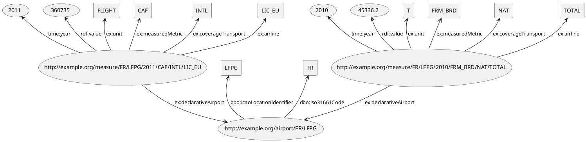

# Projet DANA 2022 - Web des Données & Web sémantique

## Participants
- Quentin GOMES DOS REIS
- Alan PROVOST
- Izzedine issa AHMAT

## Jeu de données utilisé
Pour ce projet, nous avons choisi de prendre le jeu de donnée proposé par [Eurostat](https://ec.europa.eu/eurostat/fr/).

Ce jeu de données représente les données du transport aérien de passagers par aéroports déclarants dans l'union européenne.
Il contient des données concernant le transport du fret, de courrier et de passagers mais également le nombre de sièges offerts.
La périodicité des données est multiple, nous avons des données annuelles, trimestrielles et mensuelles.

Il est sous la licence CC BY 4.0 et est disponible à l'adresse suivante [https://ec.europa.eu/eurostat/databrowser/view/AVIA_TF_ALA/default/table](https://ec.europa.eu/eurostat/databrowser/view/AVIA_TF_ALA/default/table).

## Sémantisation
En l'état, le fichier CSV n'est pas traitable au vu de sa taille (1,3Go), nous allons donc traiter uniquement les données annuelles, on utilise donc SPARQL et pour trancrire notre dataset en Turtle, avec le fichier dataset_crea_annuel.sparql.

Une fois traité avec TARQL, on obtient un fichier Turtle contenant 10 090 461 triples, ci-dessus, voici un exemples de structure de données de notre fichier Turtle.

> **:warning: ATTENTION:**\
>  Les types des valeurs des mesures changent en fonction du type de mesure, si la mesure est une masse, le type sera float sinon le type sera entier. 

